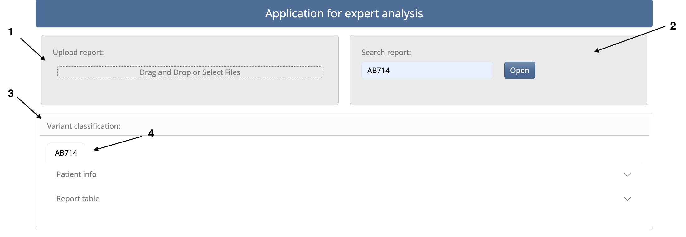
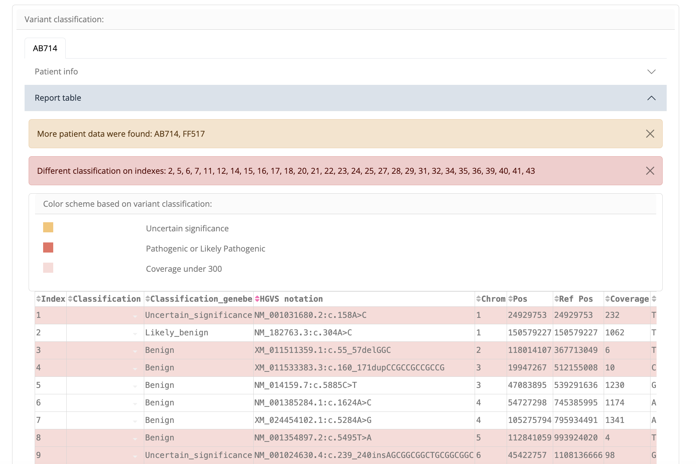
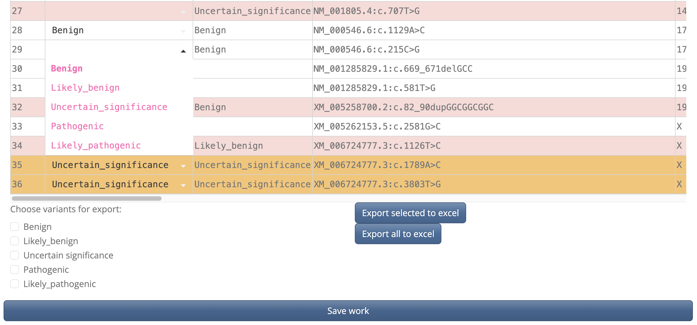
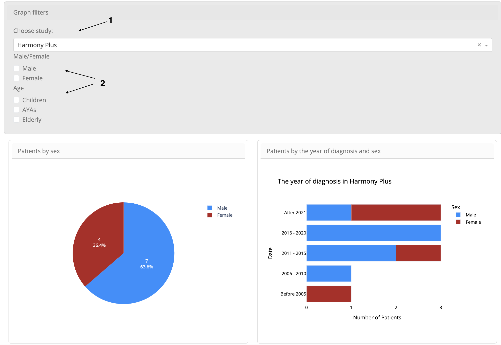

# Aplikace pro expertní analýzu genetických dat

## Spuštění splikace

### Naklonování repozitáře

1. Pomocí tlačítka "Code" zkopírujte adresu repozitáře
2. V terminálu/příkazové řádce naklonujte repozitář:
```
git clone https://github.com/katkaraj/expert_analysis_app.git
```
3. Přejďete do naklonovaného repozitáře:
```
cd expert_analysis_app
```

### Vytvoření Docker Image
1. K použití je nutné mít nainstalovaný Docker, pokud ho nemáte, nainstalujte si ho [zde](https://docs.docker.com/desktop/)
2. Vytvořte Docker Image:
```
docker build -t expert_analysis_app .
```
3. Vyčkejte dokud se nevytvoří Docker Image. Tento krok může nějaký čas trvat
4. Jakmile je Docker Image vytvořený, můžete spustit Docker container:
```
docker run -p 8050:8050 expert_analysis_app
```
5. Otevřete webový prohlížeč na adrese http://127.0.0.1:8050 nebo http://localhost:8050
pozn. aplikace byla vytvořena pro prohlížeč Google Chrome, v ostatních prohlížečích je aplikaci možné otevřít, 
ale není zaručena správná funkčnost všech komponent.

# Návod k použití

## Klasifikace variant

### Nahrání nového reportu

**Číslo 1** na obrázku  

Report lze nahrát přetažením ("drag and drop") zvoleného souboru, nebo stiknutím pole 
"Drag and Drop or Select Files" a následný výběr souboru v počítači.

### Vyhledání a otevření reportu

**Číslo 2** na obrázku  

Seznam reportů: 
- DE203
- DE444
- HI710
- BA345
- CD821
- AL123

1. Uživatel zadá do pole kód reportu
2. Stisknutím tlačítka Open se otevře report i s pacientskými údaji v části označené na obrázku **číslem 3**
   (Pokud zadá uživatel neexistující kód, aplikace ho na to upozorní)
3. Report se pod svým názvem otevře jako záložka (označeno **číslem 4**)  

  

### Klasifikace variant

Ke každému reportu jsou automaticky připojeny informace o pacientovi.
Tyto informace lze zobrazit stisknutím rozbalovací lišty s názvem "Patient info".  


Tabulka, ve které se nachází report s hodnocením variant se nachází v liště "Report table"  

- Nejprve je zobrazeno upozornění, pokud má pacient další vyšetření. V rámečku
jsou zobrazeny kódy dalších reportů
- Další upozornění vypisuje indexy variant, u kterých se liší klasifikace oproti klasifikaci v 
databázi genetických variant GeneBe.
- Další částí je legenda k podbarvení řádků tabulky
- Poslední oblastí je interaktivní tabulka s jednotlivými variantami.

  

1. Uživatel zvolí klasifikaci z rozbalovací nabídky přímo v buňce tabulky, nebo ji dovnitř napíše a potvrdí Enter
2. Takto klasifikuje všechny potřebné varianty
3. Tlačítkem "Save work" uloží práci
4. Tlačítkem "Export all to excel" má uživatel možnost exportovat celou tabulku - 
po stisknutí tlačítka začne stahování
5. Dále lze exportovat jen vybrané vyrianty zaškrtnutím příslušných políček a 
stisknutím tlačítka "Export selected to excel"


## Vizualizace dat pomocí grafů

1. Nejprve uživatel vybere studii se kterou chce pracovat v rozbalovacím menu (**číslo 1**)
2. Dále zvolí příslušné filtry (**číslo 2**)
- U každého grafu je dále vykreslena na pravé straně legenda
- všechny grafy jsou interaktivní
- po nasměrování kurzoru na barevné pole lze zobrazit
podrobné informace


